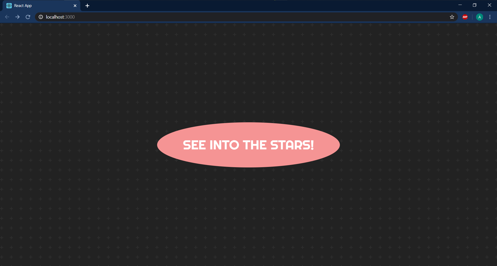
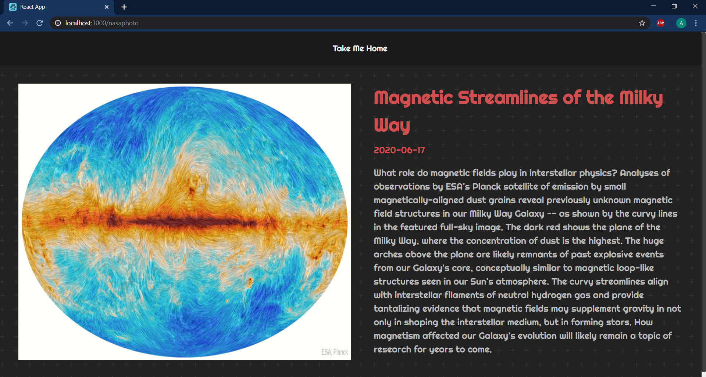

# Nasa-APOD (Astronomy Picture of the Day)

A React App that uses the Nasa's [`APOD`](https://api.nasa.gov/) API to get a new picture of the sky everyday. It's a great way to explore React
basics and at the same time get excited to build a Astronomy Photograph/Video App that changes everyday.
<br />
Don't Believe me! See for yourself today and come back later another day.

##### Topics Covered

- React Fragments
- State Management
- Effect Hooks
- Browser Router
- Async Await

## Screenshots



<hr />

```
When we click on the giant button in the middle, we would be routed to this view. 
The Picture/Video will change depending on the date on which you view.
```

<hr />



---

### Instructions to Run

##### `clone this repo`

In the project directory, you can run:

##### `npm install`

It installs the dependencies using the package.json file.

##### `npm start`

Start and runs the app which renders in real-time.

##### `npm run build`

Builds the app for production to the `build` folder.<br />
It correctly bundles React in production mode and optimizes the build for the best performance.

Your app is ready to be deployed!<br />
Cheers Mate!🍻
